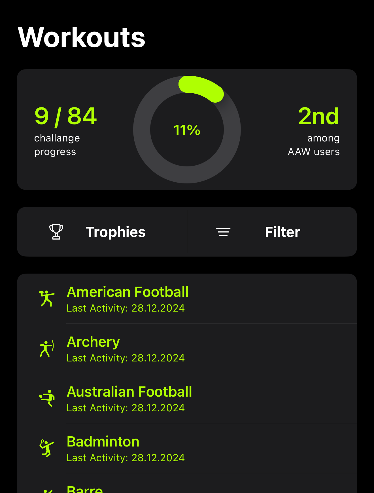

# AAW - Achieve All Workouts

An intuitive iOS app designed to track your workouts, monitor progress, and set fitness goals. The app integrates seamlessly with the Apple Watch and provides widgets for quick insights into your fitness journey.

---

  

## 📱 Features

- **Track All Workouts**: Displays a list of all available workouts in the Apple Watch app, marking completions and dates.
- **Progress Monitoring**:
  - Progress ring for total workout types.
  - Completion rate progress bar.
  - Total count of completed workouts.
- **Streak Tracking**: View current and longest workout streaks by type.
- **Achievements**: Earn trophies for every 10% of progress completed.
- **Widgets**: 
  - Small widget with a four-corner layout for selected workouts.
  - Medium widget displaying streaks for up to eight workouts.
- **Social Sharing**: Share your progress as a story on social media.
- **Apple Watch Companion App**: Start workouts and track progress directly from your Apple Watch.

## 🛠️ Technologies

- Swift, SwiftUI, Combine, UserNotifications, WatchConnectivity, XCTest
- HealthKit, WidgetKit, CloudKit
- Gemini API Model: 1.5 Flash

## 📝 To-Do

Here’s a list of planned features and enhancements for the app:

### 🚀 Features
- [ ] Add posibility to pin workouts or "add to favourites".
- [ ] Integrate real-time feature-flags sync with iCloud.
- [ ] Implement personalized workout suggestions based on user history.

### 🛠️ Technical Enhancements
- [ ] Redefine usage of Gemini API.
- [ ] App content localisation.
- [ ] Write log and share it.
- [ ] Add more unit tests for key modules.

### ✅ Completed Tasks
- [x] Add Apple Watch companion app for starting and tracking workouts.
- [x] Create widgets for streak tracking.
- [x] Integrate Gemini API (currrently just as an expirience. Functinaly no so useful **Disabled with feature-flag**).
  
## 📃 License

- This project is licensed under the MIT License.
---
